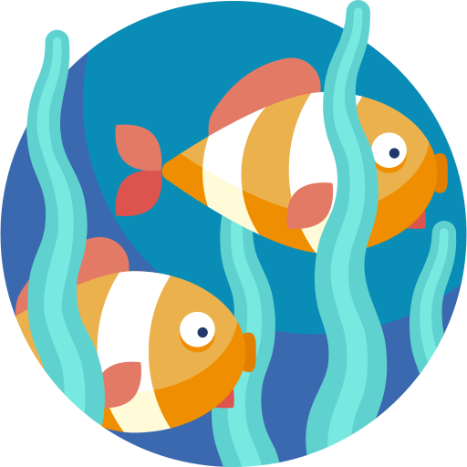

<h1 align="center">
FIAP - Fase7 - Global Solution
</h1>

OceanGuard é um aplicativo móvel com a proposta de educar e denunciar locais com lixos nas praias. Através de um jogo de memória, os usuários aprendem sobre o perigo de jogar lixo nas praias e, com a funcionalidade de denúncia, podem reportar áreas poluídas usando a API ViaCEP para identificar locais sujos e alertar as autoridades.

A FIAP, em colaboração com a UNESCO, AWS e Softtek, está empenhada em utilizar a tecnologia como catalisadora para enfrentar os desafios críticos que afetam os oceanos. Nosso objetivo é alinhar nossos esforços com a Agenda 2030 para o Desenvolvimento Sustentável, particularmente o ODS 14, que visa a conservação e o uso sustentável dos oceanos, mares e recursos marinhos.

  <a href="#-tecnologias">Tecnologias</a>&nbsp;&nbsp;&nbsp;|&nbsp;&nbsp;&nbsp;
  <a href="#-explicação-do-projeto">Explicação do Projeto</a>&nbsp;&nbsp;&nbsp;|&nbsp;&nbsp;&nbsp;
  <a href="#-justificativa-do-projeto">Justificativa do Projeto</a>&nbsp;&nbsp;&nbsp;|&nbsp;&nbsp;&nbsp;
  <a href="#-api-utilizada">API Utilizada</a>&nbsp;&nbsp;&nbsp;|&nbsp;&nbsp;&nbsp;
  <a href="#-api-utilizada">Aplicação</a>&nbsp;&nbsp;&nbsp;|&nbsp;&nbsp;&nbsp;
  <a href="#memo-licença">Licença</a>

  

  
    

 

## 🚀 Tecnologias

Esse projeto foi desenvolvido com as seguintes tecnologias:

- [React Native](https://reactnative.dev/)
- [Viacep](https://viacep.com.br/)

## 💡 Explicação do Projeto

OceanGuard é um aplicativo móvel que visa educar e incentivar a denúncia de locais com lixo nas praias. Ele oferece um jogo de memória que ensina sobre os perigos de jogar lixo nas praias e uma funcionalidade de denúncia que permite aos usuários reportar áreas poluídas. Utilizando a API ViaCEP, os usuários podem identificar locais específicos e alertar as autoridades competentes para uma ação rápida e eficiente.

## 📝 Justificativa do Projeto

A poluição das praias é um problema sério que afeta a vida marinha e a saúde dos oceanos. OceanGuard foi criado para aumentar a conscientização sobre esse problema e proporcionar uma ferramenta prática para que as pessoas possam contribuir para a limpeza das praias. Ao educar os usuários sobre os impactos do lixo e facilitar a denúncia de áreas poluídas, o aplicativo ajuda a promover a conservação e o uso sustentável dos recursos marinhos, alinhando-se com os objetivos da Agenda 2030 para o Desenvolvimento Sustentável.

## 🌐 API Utilizada

- **ViaCEP**: Utilizada para buscar e identificar endereços através do CEP. A API ViaCEP permite que os usuários localizem rapidamente as áreas sujas que precisam ser denunciadas, garantindo precisão e facilitando a comunicação com as autoridades locais.

## :sparkles: Aplicação 
- Link da aplicação => https://snack.expo.dev/@giza/projeto-ocean-guard?platform=android

## :memo: Licença

Esse projeto está sob a licença MIT.

Feito com ♥ by [Gisele Araujo Silva](https://www.linkedin.com/in/gisele-araujo-silva/) e [Vitória Ferreira](https://www.linkedin.com/in/vic-ferreira)
